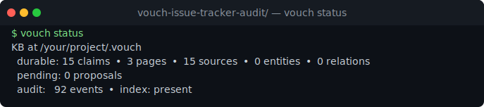
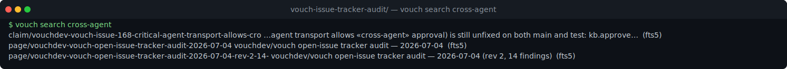
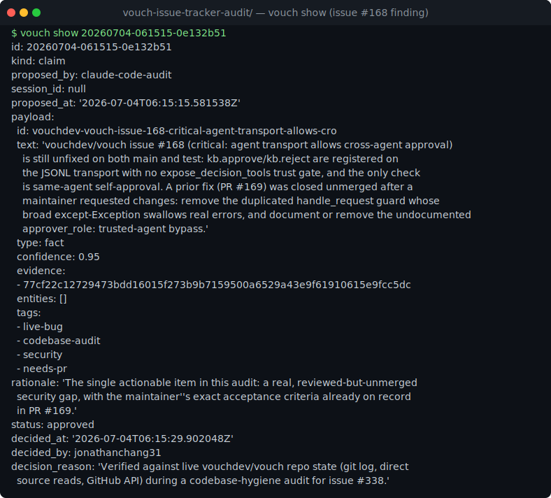
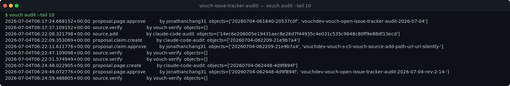

# vouch-issue-tracker-audit/

A real `vouch` knowledge base built while auditing `vouchdev/vouch`'s own
GitHub issue tracker for staleness. It's a "codebase-audit" style KB
(findings → claims, cited to evidence) rather than a project's living
documentation, submitted for issue [#338](https://github.com/vouchdev/vouch/issues/338).

- **Host:** Claude Code, driving the real `vouch` CLI (v1.1.0) directly —
  `vouch init`, `vouch source add`, `vouch propose-claim`, `vouch approve`,
  `vouch propose-page`, `vouch reindex`, `vouch doctor`.
- **What it's used for:** every open issue on `vouchdev/vouch` (93 at audit
  time) was checked against `git log --grep` on `upstream/main` and
  `upstream/test` for a commit resolving it, then spot-checked by reading the
  relevant source directly. 13 of the resulting findings are proposed claims,
  each cited to a source file containing the real evidence (a `git log`
  transcript, a code excerpt, or an actual maintainer PR-review comment
  copied from GitHub). A 14th finding — a real bug in `vouch source add
  --url` — surfaced while building this very KB and is included too.

## What to look at first

1. [vouch/pages/vouchdev-vouch-open-issue-tracker-audit-2026-07-04-rev-2-14-.md](vouch/pages/vouchdev-vouch-open-issue-tracker-audit-2026-07-04-rev-2-14-.md) —
   the findings table and method, current revision.
2. [vouch/claims/vouchdev-vouch-issue-168-critical-agent-transport-allows-cro.yaml](vouch/claims/vouchdev-vouch-issue-168-critical-agent-transport-allows-cro.yaml) —
   the one still-unfixed, security-relevant finding, with a maintainer's
   review notes on record from a prior closed PR.
3. [vouch/claims/vouchdev-vouch-s-cli-vouch-source-add-path-url-url-silently-.yaml](vouch/claims/vouchdev-vouch-s-cli-vouch-source-add-path-url-url-silently-.yaml) —
   the self-found bug in the tool used to build this KB.
4. [vouch/audit.log.jsonl](vouch/audit.log.jsonl) — the full trail: 13
   claims proposed, all 13 first rejected (wrong `--type` value), all 13
   resubmitted correctly and approved, a summary page approved, a 14th claim
   added, and a revised page approved. Nothing here was hand-written into
   `claims/` or `decided/` directly — every artifact went through
   `propose-* → approve`/`reject`.

## See it in action

After `cp -r examples/community/vouch-issue-tracker-audit/vouch ./.vouch &&
vouch reindex`, here's what the CLI shows against this KB:

`vouch status` — artifact counts and the audit-event total:

`vouch search cross-agent` — retrieval surfacing the live #168 finding:

`vouch show` on the #168 finding's decided proposal — full citation,
rationale, and decision metadata:

`vouch audit --tail 10` — the reject-then-rework and page-revision trail:

## What this example is *not*

- Not a teaching fixture — every claim, source, and audit event here is the
  byproduct of a real `vouch` session, not hand-authored YAML.
- Not exhaustive — the audit covered issues without an in-flight open PR;
  issues already claimed by another contributor's PR were excluded up front
  rather than re-checked.
- Not a fix for #168 or the `source add --url` bug — this KB documents them
  as findings with enough evidence for someone (possibly the same
  contributor, in a follow-up PR) to act on. Bundling a code fix into this
  PR would violate `CONTRIBUTING.md`'s "one concern per PR."
